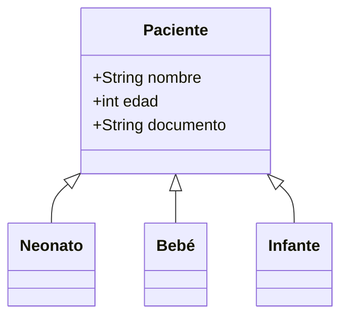

# **Documentación del Sistema de Gestión Médica**  
*(Estructuras de Datos + POO + Patrones de Diseño + Algoritmos Clave)*  

## **1. Introducción**  
Sistema de gestión médica que reemplaza bases de datos tradicionales con:  
- **Estructuras de datos en memoria** (pilas, colas, listas)  
- **POO** para modelado de entidades  
- **Patrones de diseño** para arquitectura flexible  
- **Algoritmos eficientes** para procesamiento de datos  

## **2. Estructuras de Datos**  
| Estructura | Uso | Beneficio |
|------------|-----|-----------|
| **Pilas (Stacks)** | Almacenamiento de pacientes por categoría | Acceso O(1) para inserción/eliminación |
| **Colas (Queues)** | Gestión de citas médicas (FIFO) | Garantiza equidad en asignación |
| **Listas/Arreglos** | Soporte para algoritmos de ordenamiento | Permite búsquedas eficientes |

## **3. Programación Orientada a Objetos**  
### **Jerarquía Principal**  


### **Principios Implementados**  
- **Encapsulamiento**: Atributos privados con acceso controlado  
- **Herencia**: Especialización por grupos etarios  
- **Polimorfismo**: Método `accept()` en VisitorPattern  

## **4. Patrones de Diseño**  
### **Visitor Pattern**  
```java
// Interfaz Visitor
interface Visitor {
    void visit(Neonato n);
    void visit(Bebé b);
    // [...] otros tipos
}

// Implementación concreta
class ReportVisitor implements Visitor {
    public void visit(Neonato n) {
        // Lógica específica para neonatos
    }
    // [...]
}
```

## **5. Algoritmos Clave**  
| Algoritmo | Uso | Complejidad | Implementación |
|-----------|-----|-------------|----------------|
| **Búsqueda Binaria** | Localización de pacientes | O(log n) | Requiere lista ordenada |
| **MergeSort** | Ordenamiento inicial de pacientes | O(n log n) | Divide y vencerás |
| **RadixSort** | Ordenamiento de citas por fecha | O(nk) | Estable para datos heterogéneos |

## **6. Flujo de Datos**  
1. **Entrada**: Nuevo paciente registrado → almacenado en stack correspondiente  
2. **Procesamiento**:  
   - MergeSort ordena pacientes para búsqueda  
   - RadixSort organiza agenda médica  
3. **Salida**:  
   - Visitor genera reportes específicos  
   - Búsqueda binaria recupera registros  

## **7. Conclusión**  
Este enfoque demuestra que es posible construir sistemas complejos:  
- **Sin dependencia de DBMS** mediante estructuras de datos óptimas  
- **Mantenible** gracias a POO y patrones de diseño  
- **Eficiente** con algoritmos seleccionados para cada caso de uso  
